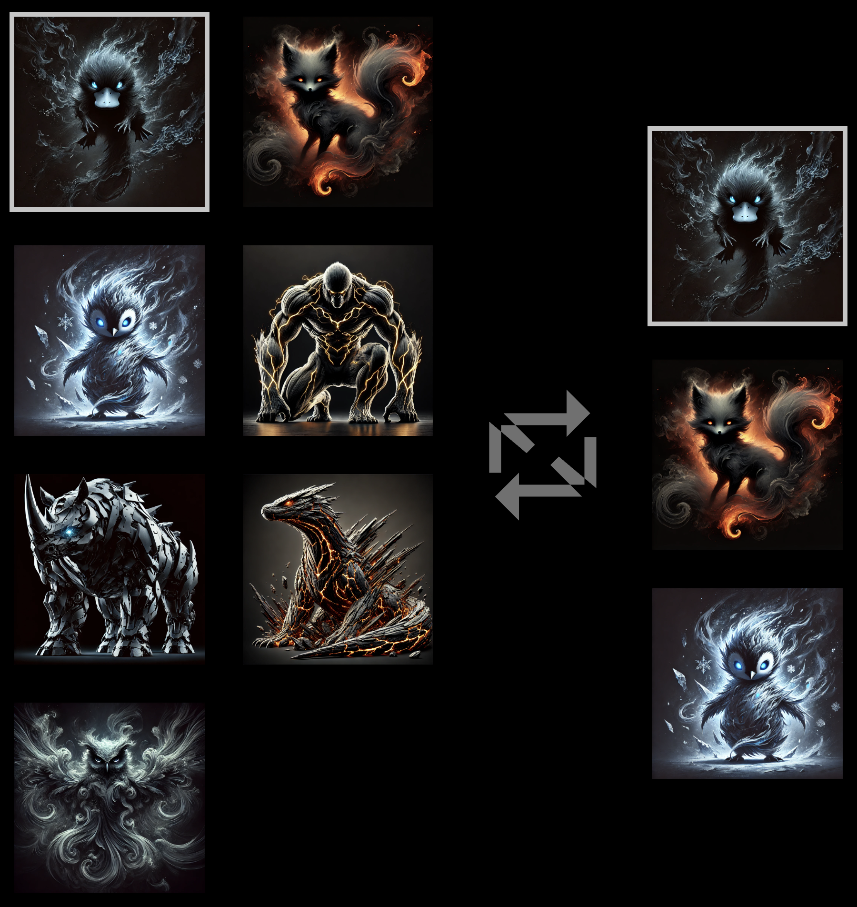

# Void Elementals

Void Elementals is a full-stack dApp project that combines a React frontend with
a backend service.



## Features

- ⚡️ Modern frontend built with [Vite](https://vitejs.dev/)
- 🔗 Web3/DeFi integration (customize with your own smart contracts)
- 🎮 Gaming + DeFi platform structure (frontend + backend)

## Getting Started

### Prerequisites

- [Node.js](https://nodejs.org/) (v16+ recommended)
- [npm](https://www.npmjs.com/)

### Installation

Clone the repository:

```bash
git clone https://github.com/your-username/void-elementals.git
cd void-elementals
```

Install dependencies and start the project:

```bash
cd client
npm install
npm run dev
```

By default, the app will be available at http://localhost:5173/ (Vite’s default
port).

## Folder Structure

```text
client/  # Frontend (React + Vite)
backend/  # Backend server (Node.js / Express)
contracts/  # Smart contracts (Solidity/Hardhat or Foundry)
```

## Development Scripts

From the project root:

- `npm run dev` – Start frontend + backend concurrently

- `npm run build` – Build frontend and backend

- `npm run lint` – Run lint checks

## Contributing

Pull requests are welcome. For major changes, open an issue first to discuss
what you would like to change.

## License

[MIT](LICENSE)
